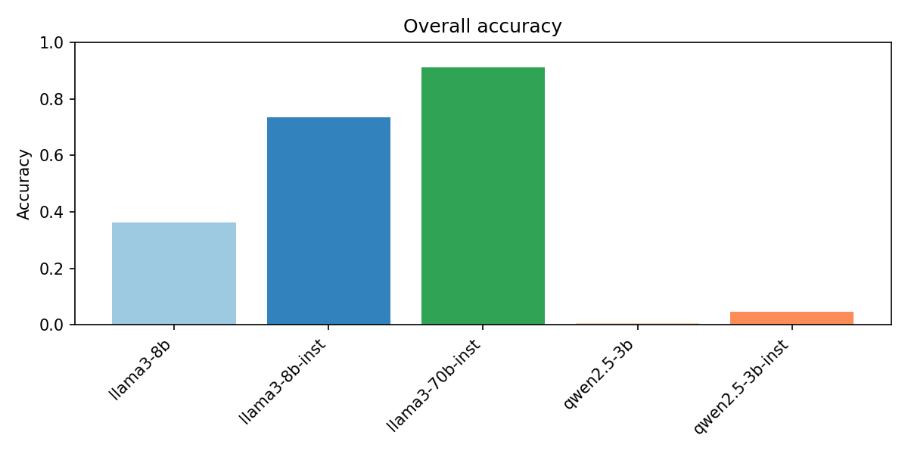
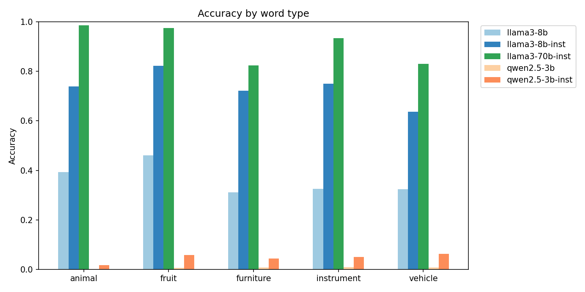
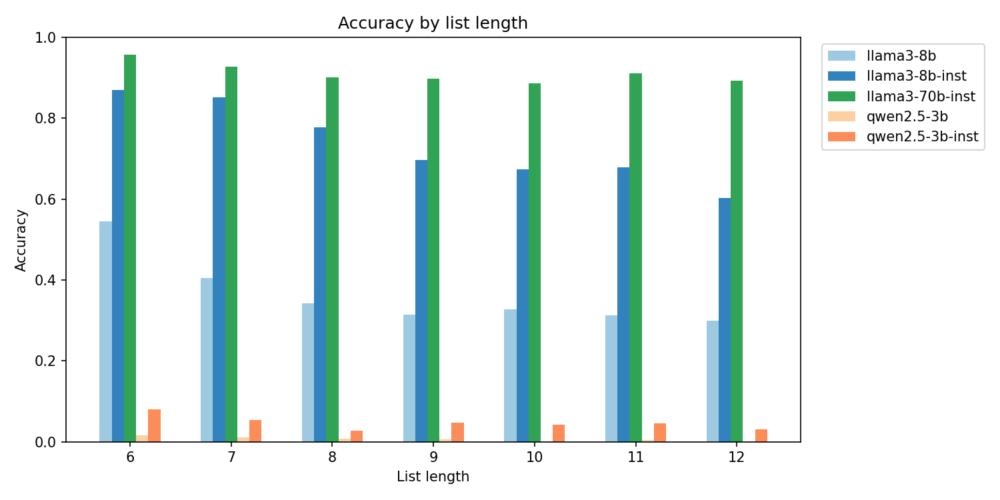
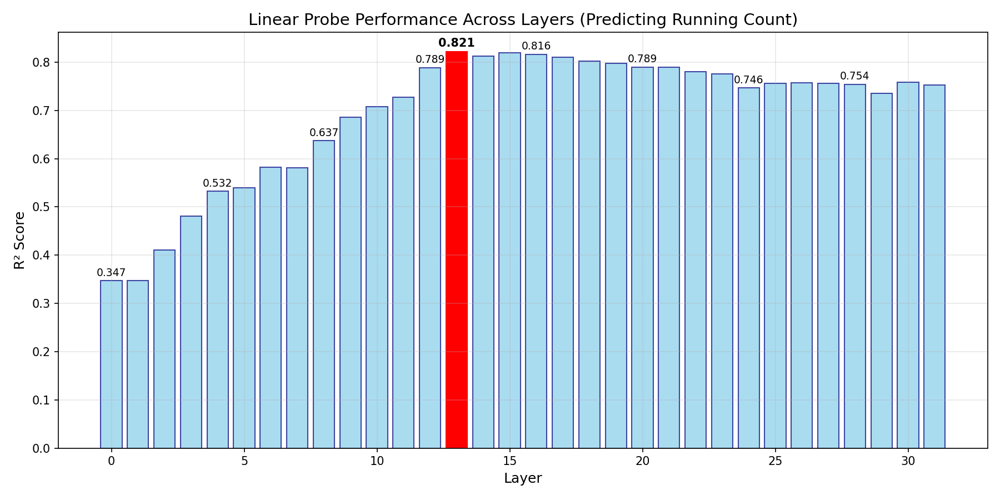
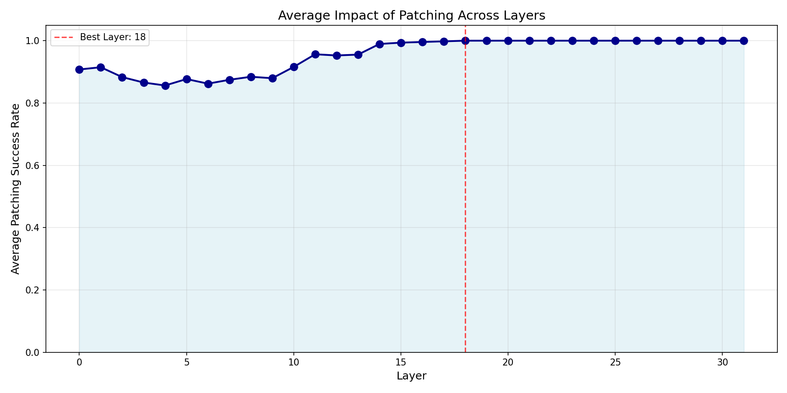
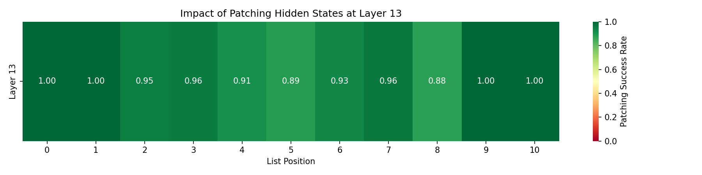
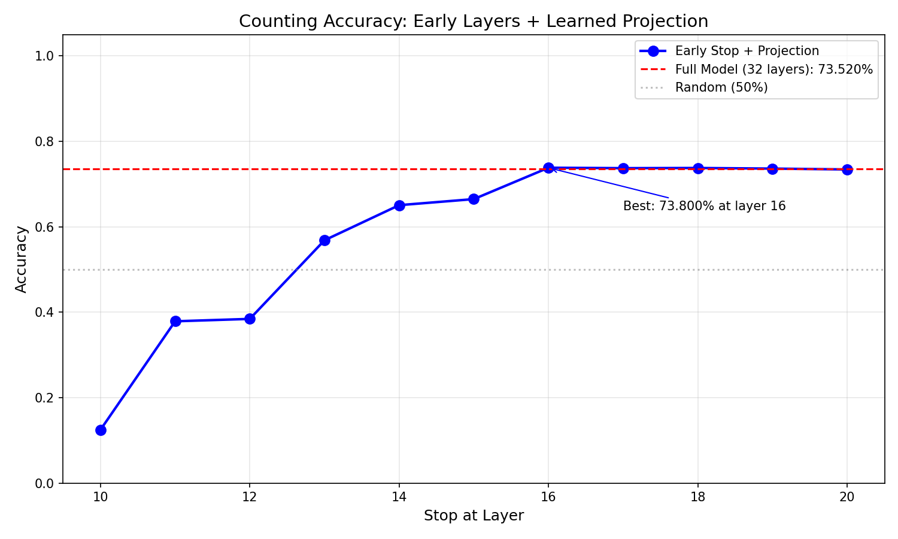

# Mechanistic Analysis of Counting in Llama-3-8B-Instruct

Author: [Lihao Sun](https://sites.google.com/uchicago.edu/lihao-sun) (University of Chicago)

This repository implements a pipeline for investigating which layer in large language models (LLMs) maintain a running count of category‐matching words when processing prompts such as:
> Count the number of words in the following list that match the given type, and put the numerical answer in parentheses. 
> Type: fruit 
> List: [dog, apple, cherry, bus, cat, grape, bowl] 
> Answer: ( 

The experiments consist of bahavioral (prompt construction + open model evaluations) and mechanistic (linear probe + patching) parts. 

## Behavioral 
### Prompt Construction
> 📁Relevant Files: prompt_suite.ipynb

We create a synthetic dataset of prompts of the form: 
> Count the number of words in the following list that match the given type, 
> and put the numerical answer in parentheses. 
> Type: CATEGORY  
> List: [w₁, w₂, ..., w_N] 
> Answer: ( 

where:
- CATEGORY is drawn uniformly from a predefined set of semantic categories (“fruit,” “animal,” “vehicle,” “instrument,” “furniture”).
- Each word list is of random length between 6 and 12 words, sampled (without replacement) from the union of all category pools. 
- We ensure at least one matching word per list, so that the correct answer is never zero.
- We compute the ground‐truth integer answer by counting how many list entries belong to the selected category.

### Benchmarking Models
> 📁Relevant Files: behavioral_eval.ipynb

We evaluate a set of open‐weight LLMs on 5,000 prompts in a zero‐shot regime (no chain‐of‐thought steps, no appended reasoning instructions). Each model is asked exactly the prompt (ending in Answer: (), and we capture its next‐token generation(s) to extract the predicted integer.

Models Evaluated:
> "llama3-8b-instr" : "meta-llama/Meta-Llama-3-8B-Instruct" 
> "llama3-8b"       : "meta-llama/Meta-Llama-3-8B" 
> "llama3-70b-instr": "meta-llama/Meta-Llama-3-70B-Instruct" 
> "qwen2.5-3b-instr": "Qwen/Qwen2.5-3B-Instruct" 
> "qwen2.5-3b"      : "Qwen/Qwen2.5-3B" 

#### Behavioral Results 
> 📁Relevant Files: behavioral_results/

**Model size and instruction tuning are important factors.** LLaMA3-70B-Instruct achieves the highest accuracy (~91%), with LLaMA3-8B-Instruct performing well (~73%) and the base 8B model trailing behind (~36%). Qwen2.5-3B variants perform near chance, highlighting the necessity of both scale and alignment for this counting task. 

**Models generally perform at similar levels across word types.** Models generally show consistent accuracy across all five semantic categories, suggesting robust generalization. 

**List length generally does not matter for large models like 70B, whereas 8B models' performance deteriorates as the list gets longer.** LLaMA3-70B-Instruct remains accurate even on 12-word lists. LLaMA3-8B-Instruct shows mild drop-off, and the base 8B model degrades more sharply. Qwen models are inaccurate regardless of list length.

## Mechanistic
### Methodology
We focus on the Llama 3-8B-Instruct model and use a causal-mediation (activation-patching) framework. The analysis proceeds in: 
- Hidden-State Caching and Linear Probing
- Activation Patching and Causal Evaluation

Each phase is explained below.

#### Hidden-State Caching and Linear Probing
> 📁Relevant Files: causal_mech_interp.ipynb

In order to study cases where the model demonstrably formed a valid internal count, we filter the predictions file to keep the first N = 200 examples where pred == gold. This yields a subset of prompts where the model's final answer exactly matches the ground truth, ensuring that it likely performed the intended reasoning.

- Hidden State Collection:

  For each of the 200 prompts, we extract hidden states from all 32 transformer layers while the model processes the input list. We align each list word to its token index to track the exact representation used during counting.

- Linear Probe Training:

  For each layer ℓ, we train a Ridge regression model to predict the running count of matching category words (e.g., fruits) up to each list position, using the residual stream at that position.

- Probe Evaluation:

  We compute R² scores on a held-out validation set to assess how well each layer linearly encodes the current count.

##### Linear Probing Results 

**Running-count information becomes linearly accessible in middle layers.**  We trained a Ridge regression probe at each layer to predict the running count of category matches. Probe R² scores steadily rise through early layers and peak at Layer 13 (R² = 0.821), then plateau across later layers. This suggests that the model builds up a linearly decodable internal representation of the count around mid-depth, with Layer 13 chosen as the best candidate for causal analysis.

#### Activation Patching and Causal Evaluation
> 📁Relevant Files: causal_mech_interp.ipynb

To assess whether the identified layer causally contributes to the model’s final answer, we perform targeted activation patching.

- Setup:
  
  For each prompt and list index k, we create a prefix-permuted version of the prompt by randomly shuffling the first k+1 words in the list. This changes the running count up to that point, but leaves the rest of the prompt unchanged.

- Patching Procedure:
  
  We extract the hidden state from the permuted run at layer ℓ* (identified from probing) and insert it into the clean run at the corresponding token position. We then let the model finish its forward pass and decode its new final prediction.

- Evaluation:
  
  If the patched model now outputs the counterfactual final count (i.e., the total number of matching items in the permuted list), we mark the patch as successful.

##### Patching Results 

**Mid-to-late layers are causally involved in producing the final count.**  We compute average patching success across layers by replacing hidden states with prefix-permuted alternatives and checking if the model flips its final answer accordingly. Success rises from early layers and saturates by Layer 18 (marked as best), indicating that running-count information becomes not just represented but causally used in the upper middle layers.

**Patching Layer 13 reliably shifts model outputs.**  When we patch only the kth token's hidden state at Layer 13, the model flips to the counterfactual count in over 90% of cases across all list positions. This confirms that Layer 13 contains a localized representation of the running count that directly influences the final output.

#### Early-Stop + Projection Decoding
> 📁 Relevant Files: early_stop.ipynb ; projection_plots/

We test whether layers ≥ 13 are needed after the running-count signal appears.
Instead of finishing all 32 layers, we stop early and learn a lightweight projection that maps the hidden state at a chosen layer back into the final-layer space, then decode the answer from that projected representation.

- Setup:

  For stop-layers 10 → 20 we freeze the model and capture hidden states at (stop-layer, final-layer) for 2,000 training prompts.
Projection Training	Train a small MLP + residual (ProjectionLayer) to transform the stop-layer vector into a vector that matches the final-layer distribution (MSE + cos-sim loss). 

- Early-Stop Inference: 

  At inference we run the model only up to the stop-layer, project that hidden state, apply the model’s final LayerNorm + lm_head, and greedily decode the integer (≤ 3 tokens).

- Evaluation: 

  Compare counting accuracy of each early-stop layer to the full 32-layer baseline on the complete 5,000 prompts dataset. A near-baseline score indicates that deeper layers add little beyond forwarding the count.

##### Early-Stop Results

**Stopping at layer 16 and projecting its hidden state yields the same accuracy as running the full 32-layer model; layers ≥ 17 bring no further benefit.** With a learned projection, accuracy rises sharply from 12% with early stop at layer 10 to 65% at layer 14 and plateaus at the baseline level by layer 16. This confirms that the running-count representation is already complete and decision-ready by mid-depth; deeper layers mainly forward the scalar without improving the answer. 
